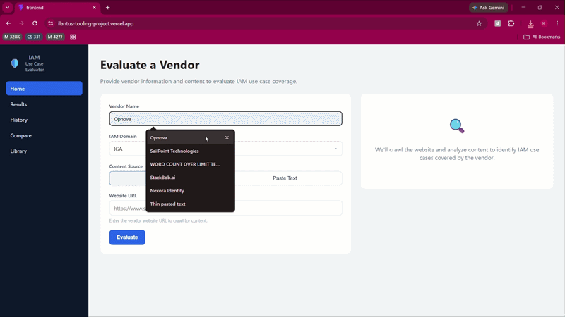
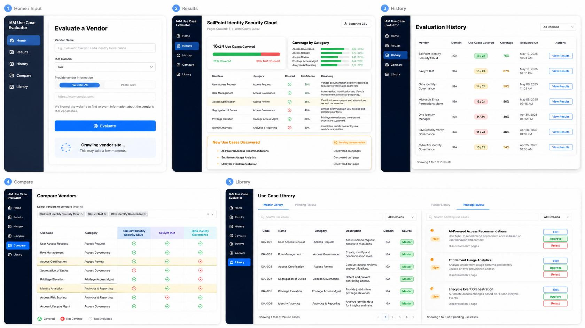
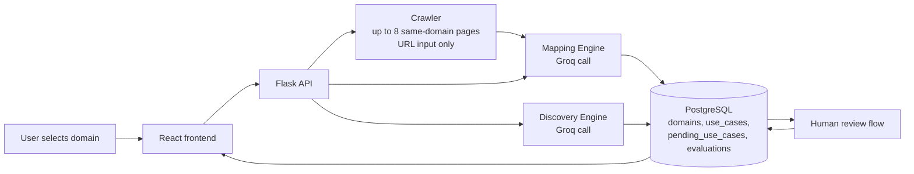

# IAM Vendor Capability Evaluator


A full-stack tool that evaluates an IAM (Identity and Access Management) vendor's
product — from a website URL or pasted text — against a domain-scoped library of
use cases, using the Groq API as the LLM backend. It returns a structured gap
analysis of what the vendor covers, automatically discovers vendor capabilities
that represent new use cases not yet in the library, and queues them for human
review before folding approved ones back into the library for future evaluations.

## Demo



*(placeholder — record per the shot list below and drop the GIF at `docs/demo.gif`)*

**Live app:** https://ilantus-tooling-project.vercel.app/
**Live API:** https://ilantus-tooling-project.onrender.com/api/health

## UI



## How it works

1. **Select an IAM domain** (e.g. Identity Governance and Administration) and
   provide vendor input — either a website URL or pasted product text.
2. **Crawler** (URL input only): same-domain crawl of up to 8 pages
   (`backend/scraper.py`), stripping nav/header/footer/script boilerplate and
   filtering out noise pages (careers, legal, blog, etc.) to isolate real
   product content.
3. **Mapping Engine** (`backend/mapping_engine.py`): one Groq call evaluates the
   vendor text against every existing use case in the selected domain, returning
   only evidence-based matches with a confidence score and one-line reasoning.
4. **Discovery Engine**: a second, separate Groq call looks for vendor
   capabilities that represent genuinely new use cases not already in that
   domain's library. New suggestions are deduplicated against pending
   suggestions and inserted with `status='pending'` for human review.
5. **Human review**: pending suggestions surface in the Library page. Approving
   one promotes it into the domain's live use case library (`source =
   'llm_approved'`) so it's evaluated against on every future vendor in that
   domain; rejecting discards it.
6. **Result**: a coverage report — covered vs. missed use cases, confidence per
   match, and any newly discovered capabilities — stored in Postgres and
   viewable later from History/Compare.

## IAM domains

| Code | Domain |
|---|---|
| IGA | Identity Governance and Administration |
| PAM | Privileged Access Management |
| CIAM | Customer Identity and Access Management |
| AM | Access Management and SSO |
| DIR | Directory Services |
| IRM | Identity Risk Management |
| NHI | Non-Human Identity Management |

Each domain has its own independently-scoped use case library — a use case
discovered and approved under IGA has no effect on PAM's library.

## Use case library

Every use case has a `source`:
- `manual` — seeded at project setup, the initial baseline library per domain.
- `llm_approved` — discovered by the Discovery Engine and approved via human
  review; treated identically to `manual` in future mapping runs.

Use cases still awaiting review sit in a separate `pending_use_cases` table and
are not evaluated against until approved.

## Architecture



## Local setup

### Backend

```powershell
cd backend
python -m venv venv
.\venv\Scripts\Activate.ps1
pip install -r requirements.txt
```

Create a `.env` file at the **project root** (not inside `backend/`) with:

```
GROQ_API_KEY=your_groq_key_here
DATABASE_URL=your_neon_connection_string_here
```

Verify the setup, then run the API:

```powershell
python verify_setup.py
flask run
```

### Frontend

```powershell
cd frontend
npm install
npm run dev
```

In dev, `frontend/src/api.js` proxies `/api` to `http://localhost:5000` via
`vite.config.js` — no env var needed locally. For a production build, set
`VITE_API_URL` (see `frontend/.env.example`) to your deployed backend's base
URL, e.g. `https://ilantus-tooling-project.onrender.com/api`.

### Optional: local Postgres instead of Neon

```powershell
docker-compose up -d
```

## Deployment

- **Backend**: Render, root directory `backend/`, `GROQ_API_KEY` /
  `DATABASE_URL` / `MAX_CRAWL_PAGES` set as environment variables.
- **Frontend**: Vercel, root directory `frontend/`, `VITE_API_URL` pointing at
  the Render backend, `frontend/vercel.json` handles the SPA rewrite for
  React Router.
- **Database**: Neon Postgres, shared between local dev and production.
- **CI**: GitHub Actions (`.github/workflows/ci.yml`) runs flake8 and pytest on
  the backend on every push to any branch.

Render's free tier has a ~30s request timeout — crawling several pages plus two
Groq calls can occasionally exceed it. `MAX_CRAWL_PAGES` is lowered to 4 in
production to reduce that risk; paste-text input sidesteps the crawl step
entirely and is the more reliable option for live demos.

## Future improvements

- Cross-domain vendor evaluation (e.g. a vendor spanning both IGA and PAM)
- Async background crawling to avoid HTTP timeouts on slow or large vendor sites
- ML-based confidence scoring trained on manually labeled evaluations
- Batch vendor evaluation via CSV upload
- Scheduled re-evaluation to track how vendor capabilities change over time
- Similarity scoring using embeddings to make the deduplication check more
  robust than string matching
- Role-based access so multiple team members can collaborate on the review queue
- Exportable PDF report formatted for executive review

## License

MIT

## Contact

Karan Gupta — [karangu1022@gmail.com](mailto:karangu1022@gmail.com) —
[github.com/KaranGupta-1022](https://github.com/KaranGupta-1022)
